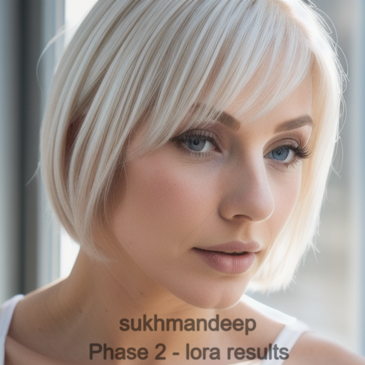
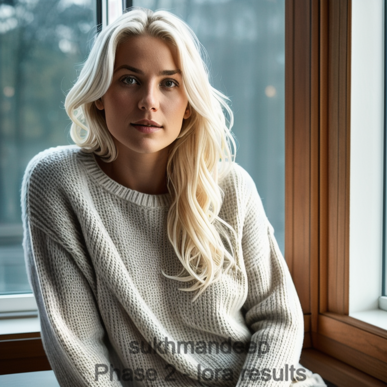
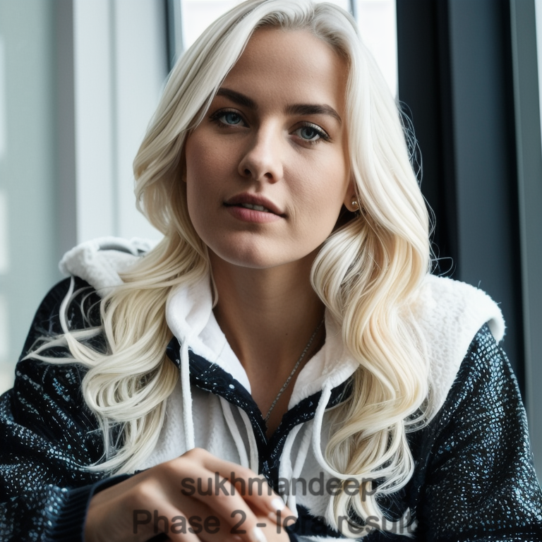
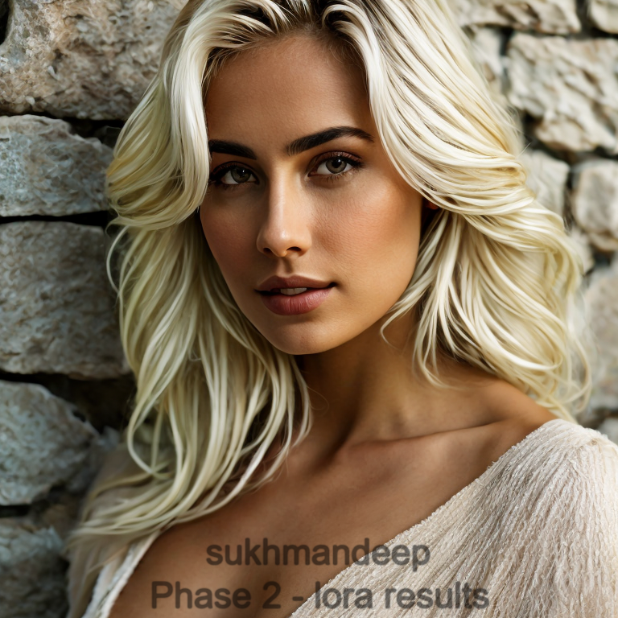
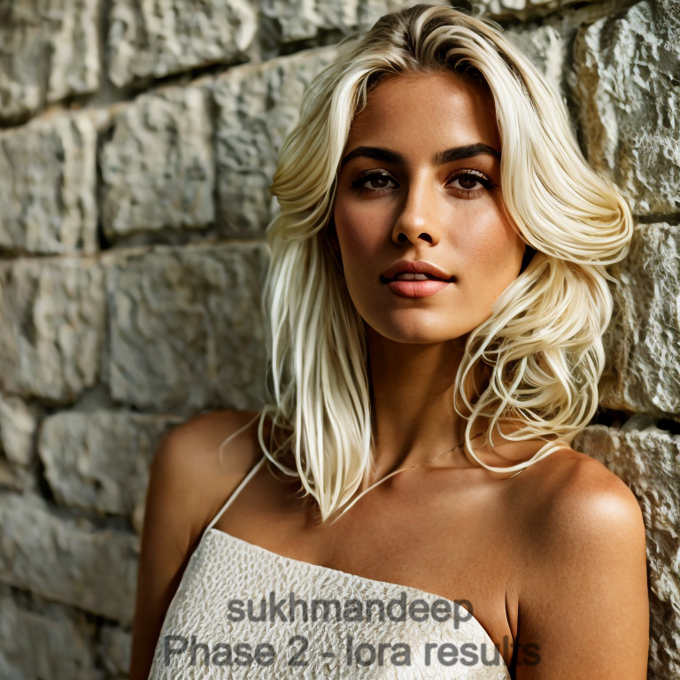
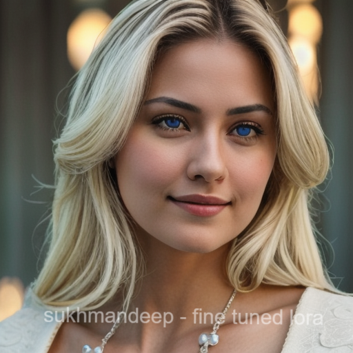

<p align="center">
  <h1 align="center">🎨 Stable Diffusion LoRA + DreamBooth Fine-Tuning</h1>
  <p align="center">
    <em>Efficient training pipeline for customizing Stable Diffusion models under limited GPU memory constraints.</em>
  </p>
  <p align="center">
    <a href="https://www.python.org/downloads/"></a>
    <a href="https://pytorch.org/"></a>
    <a href="https://huggingface.co/docs/diffusers"></a>
    <a href="https://huggingface.co/docs/accelerate"></a>
    <a href="https://fastapi.tiangolo.com/"></a>
    <a href="https://react.dev/"></a>
    <a href="LICENSE"></a>
  </p>
</p>

---

## ⚡ Quick Start

```bash
git clone https://github.com/sukhmansaran/fine-tuning-stable-diffusion-models-lora-dreambooth.git
cd fine-tuning-stable-diffusion-models-lora-dreambooth

# Install Python deps
pip install torch --index-url https://download.pytorch.org/whl/cu121
pip install xformers
pip install -r requirements.txt

# Download base model (~7 GB)
huggingface-cli download SG161222/Realistic_Vision_V5.1_noVAE --local-dir ./models/base

# Terminal 1 — API
uvicorn src.api:app --host 0.0.0.0 --port 8000

# Terminal 2 — UI
cd frontend && npm install && npm start
# API → http://localhost:8000
# UI  → http://localhost:3000
```

> See [QUICKSTART.md](QUICKSTART.md) for the full step-by-step guide.


## 📖 Project Overview

This repository provides a modular, config-driven pipeline for fine-tuning Stable Diffusion models using **LoRA** (Low-Rank Adaptation) combined with **DreamBooth** personalization techniques.

Training large diffusion models from scratch is prohibitively expensive. Full DreamBooth fine-tuning requires updating all model parameters, demanding 24 GB+ VRAM and risking catastrophic forgetting of the base model's capabilities. This project solves both problems:

- **LoRA** injects small, trainable low-rank matrices into frozen attention layers, reducing trainable parameters to ~0.1–0.5% of the full model while preserving base knowledge.
- **DreamBooth** teaches the model a new subject (a person, style, or object) from just a handful of images using a unique trigger token.
- **Dual-phase training** separates facial feature learning (phase 1) from body structure learning (phase 2), with independent LoRA adapters that can be blended at inference time.

The entire pipeline was developed and validated on **Kaggle Tesla T4 GPUs** (16 GB VRAM), proving that high-quality personalization is achievable without enterprise hardware.

## ✨ Features

| Feature | Description |
|---|---|
| 🔧 **LoRA Fine-Tuning** | Custom `LoRALinear` wrapper — no dependency on `peft` |
| 🧑 **DreamBooth Personalization** | Single-subject learning with trigger token injection |
| 🔄 **Dual-Phase Training** | Phase 1 (face) + Phase 2 (body) with frozen/trainable adapter separation |
| ⚡ **Mixed Precision** | FP16 training via HuggingFace Accelerate |
| 📝 **Config-Driven** | All hyperparameters in a single YAML file |
| 🖥️ **CLI Scripts** | One-command training and inference via shell scripts |
| 🎯 **Attention + Feedforward Patching** | Optional MLP layer patching for increased expressiveness |
| 💾 **Safetensors Checkpoints** | Periodic saving in the safe, fast `.safetensors` format |
| 🌱 **Reproducible** | Seeded training with deterministic backends |
| 🌐 **REST API** | FastAPI server for programmatic image generation |
| 🖼️ **React UI** | Browser-based frontend for interactive generation |
| 🚀 **CI/CD** | GitHub Actions pipeline — lint and build on every push |

## 🏗️ Architecture Overview

```
┌──────────────┐     ┌──────────────┐     ┌────────────────────┐
│   Dataset     │────▶│  Tokenizer   │────▶│  Text Encoder      │
│  (img + txt)  │     │  (CLIP)      │     │  (+ LoRA adapters) │
└──────────────┘     └──────────────┘     └────────┬───────────┘
                                                    │
┌──────────────┐     ┌──────────────┐              │
│   Images      │────▶│     VAE      │              │
│  (pixel)      │     │   Encoder    │              │
└──────────────┘     └──────┬───────┘              │
                            │                       │
                            ▼                       ▼
                     ┌──────────────────────────────────┐
                     │           UNet (Frozen)           │
                     │    + LoRA adapters (trainable)    │
                     │   [to_q, to_k, to_v, to_out]     │
                     └──────────────┬───────────────────┘
                                    │
                                    ▼
                     ┌──────────────────────────────────┐
                     │     Noise Prediction Loss (L1)    │
                     │     Backprop → LoRA params only   │
                     └──────────────────────────────────┘
```

The LoRA adapter math is straightforward:

```
Output = Frozen_Linear(x) + LoRA_Up(LoRA_Down(x)) × (α / r)
```

Where `r` is the rank (default: 4) and `α` is the scaling factor (default: 8). Only `LoRA_Down` and `LoRA_Up` are trained — the original weights never change.

## 📁 Project Structure

```
.
├── .github/
│   └── workflows/
│       └── ci-cd.yml                   # GitHub Actions — lint & build on every push
├── configs/
│   ├── training_config.yaml            # Attention-only training hyperparameters
│   └── training_config_feedforward.yaml
├── frontend/                           # React + Vite web UI
│   ├── index.html                      # Vite entry point
│   ├── vite.config.js                  # Vite config (proxies /api → :8000)
│   ├── package.json
│   └── src/
│       ├── App.jsx                     # Three-tab UI: Dataset → Fine-Tune → Generate
│       ├── App.css
│       ├── index.jsx
│       └── index.css
├── src/
│   ├── __init__.py
│   ├── api.py                          # FastAPI server (scan, train, generate)
│   ├── dataset.py                      # Image-caption dataset loader
│   ├── pipeline.py                     # LoRA layers, model patching, weight I/O
│   ├── train_lora.py                   # Attention-only LoRA training
│   ├── train_lora_feedforward.py       # Attention + feedforward LoRA training
│   ├── train_dreambooth.py             # Dual-phase DreamBooth training
│   ├── inference.py                    # CLI image generation
│   └── utils.py                        # Helpers
├── scripts/
│   ├── train_lora.sh
│   ├── train_lora_feedforward.sh
│   ├── train_dreambooth.sh
│   └── generate_images.sh
├── tests/
│   └── test_api.py
├── notebooks/                          # Original Jupyter notebooks
├── results/sample_outputs/
├── QUICKSTART.md                       # Step-by-step run guide
├── .env.example
├── requirements.txt
├── environment.yaml
├── LICENSE
└── README.md
```

## 🚀 Installation

```bash
git clone https://github.com/sukhmansaran/fine-tuning-stable-diffusion-models-lora-dreambooth.git
cd fine-tuning-stable-diffusion-models-lora-dreambooth

# Create and activate virtual environment
python -m venv .venv
.venv\Scripts\activate        # Windows
# source .venv/bin/activate   # Mac/Linux

# Install torch first (CUDA 12.1 build)
pip install torch --index-url https://download.pytorch.org/whl/cu121
pip install xformers
pip install -r requirements.txt

# Option 2: conda
conda env create -f environment.yaml
conda activate sd-lora-dreambooth
```

> **Requires:** Python ≥ 3.10, Node.js ≥ 18, NVIDIA GPU with CUDA 12.1+.

## 🖥️ CUDA Requirements

This pipeline was developed and tested on **Kaggle Tesla T4** GPUs.

| Component | Minimum | Recommended |
|---|---|---|
| **GPU** | NVIDIA T4 / RTX 3060 | RTX 3090 / A100 |
| **VRAM** | 12 GB | 16 GB+ |
| **CUDA** | 11.8 | 12.1+ |
| **Python** | 3.10 | 3.11+ |

Verify your setup:

```bash
python -c "import torch; print(f'CUDA available: {torch.cuda.is_available()}')"
python -c "import torch; print(f'GPU: {torch.cuda.get_device_name(0)}')"
```

## 🏋️ Training

### Dataset Preparation

Organize your training images with matching text captions:

```
data/train/
├── 001.png
├── 001.txt          # "sks, portrait photo, natural lighting, ..."
├── 002.jpg
├── 002.txt          # "sks, full body shot, outdoor, ..."
└── ...
```

Every caption should include your trigger word (e.g., `sks`).

### Attention-Only LoRA Training

Patches `to_q`, `to_k`, `to_v`, `to_out` on UNet and `q_proj`, `k_proj`, `v_proj`, `out_proj` on CLIP text encoder.

Edit `configs/training_config.yaml` with your paths, then:

```bash
# Via shell script
bash scripts/train_lora.sh

# Or directly
accelerate launch src/train_lora.py --config configs/training_config.yaml
```

### Attention + Feedforward LoRA Training

Same attention patching as above, plus feedforward layers: `GEGLU.proj` and MLP output on UNet, `fc1` and `fc2` on text encoder. More expressive, higher VRAM usage.

Edit `configs/training_config_feedforward.yaml` with your paths, then:

```bash
# Via shell script
bash scripts/train_lora_feedforward.sh

# Or directly
accelerate launch src/train_lora_feedforward.py --config configs/training_config_feedforward.yaml
```

### Dual-Phase DreamBooth Training

After completing phase 1, enable phase 2 in the config:

```yaml
phase2:
  enabled: true
  phase1_lora_path: "./outputs/lora/step_3330/lora_weights.safetensors"
  dataset_dir: "./data/train_phase2"
  max_train_steps: 3240
```

```bash
bash scripts/train_dreambooth.sh
```

### Key Configuration Parameters

| Parameter | Default | Description |
|---|---|---|
| `learning_rate` | `4e-5` | AdamW learning rate |
| `lr_scheduler` | `cosine` | LR decay schedule (`cosine`, `linear`, `constant`) |
| `lora_r` | `4` | LoRA rank — controls adapter capacity |
| `lora_alpha` | `8` | LoRA scaling factor |
| `batch_size` | `1` | Images per step (increase `gradient_accumulation` instead) |
| `gradient_accumulation` | `4` | Effective batch = `batch_size × gradient_accumulation` |
| `max_train_steps` | `3330` | Total training steps (~20–30× your image count) |
| `mixed_precision` | `fp16` | Mixed precision mode |
| `train_text_encoder` | `true` | Also LoRA-patch the CLIP text encoder |

## 🖼️ Inference

### Single-Phase Generation

```bash
python src/inference.py \
    --model_path ./models/base \
    --lora_path ./outputs/lora/step_3330/lora_weights.safetensors \
    --prompt "sks, cyberpunk astronaut, cinematic lighting, 8k" \
    --num_images 4 \
    --height 768 --width 768 \
    --guidance_scale 6.5 \
    --steps 30 \
    --trigger_word sks \
    --output_dir results/sample_outputs
```

### Dual-Phase Generation

```bash
python src/inference.py \
    --model_path ./models/base \
    --lora_path ./outputs/lora/step_3330/lora_weights.safetensors \
    --dual_phase \
    --phase2_weight 0.3 \
    --prompt "sks, portrait photo, studio lighting" \
    --num_images 4 \
    --trigger_word sks
```

The `--phase2_weight` flag controls blending between adapters:
- `0.0` → Phase 1 only (face-focused)
- `1.0` → Phase 2 only (body-focused)
- `0.3` → 70% phase 1 + 30% phase 2 (recommended starting point)

Generated images are saved to `results/sample_outputs/` by default.

## 🎭 Example Outputs

<p align="center">
  
  
  
</p>
<p align="center">
  
  
  
</p>
<p align="center"><em>Generated using LoRA-finetuned Realistic Vision V5.1 with trigger word personalization.</em></p>

## 📊 Training Details

| Detail | Value |
|---|---|
| **Base Model** | [Realistic Vision V5.1](https://huggingface.co/SG161222/Realistic_Vision_V5.1_noVAE) |
| **VAE** | [stabilityai/sd-vae-ft-mse](https://huggingface.co/stabilityai/sd-vae-ft-mse) |
| **Training Hardware** | Kaggle Tesla T4 (16 GB VRAM) |
| **Epochs** | ~90 |
| **Final Loss** | ~0.233 (L1) |
| **Optimizer** | AdamW |
| **Learning Rate** | 4e-5 with cosine decay |
| **Batch Size** | 1 (effective 4 via gradient accumulation) |
| **LoRA Rank** | 4 |
| **LoRA Alpha** | 8 |
| **Mixed Precision** | FP16 |
| **Trainable Params** | ~0.1–0.5% of total model |

### GPU Memory Usage

| Configuration | Approx. VRAM |
|---|---|
| Attention-only LoRA, batch=1 | ~12 GB |
| Attention + feedforward LoRA, batch=1 | ~14 GB |
| Dual-phase training, batch=1 | ~14 GB |
| Inference (768×768) | ~6 GB |

> **Tip:** Use `batch_size: 1` with `gradient_accumulation: 4` to simulate larger batches without exceeding VRAM. Keep `resolution: 512` for stable training on 16 GB cards.

## 🛠️ Tech Stack

<p>
  
  
  
  
  
  
  
  
  
  
</p>

| Tool | Role |
|---|---|
| **PyTorch** | Deep learning framework |
| **Diffusers** | Stable Diffusion pipeline and schedulers |
| **Transformers** | CLIP text encoder and tokenizer |
| **Accelerate** | Distributed training, mixed precision, gradient accumulation |
| **Safetensors** | Fast, safe model weight serialization |
| **LoRA** | Custom low-rank adaptation (no `peft` dependency) |
| **DreamBooth** | Subject personalization via trigger token |
| **FastAPI** | REST API server for dataset scanning, training, and inference |
| **React** | Web frontend — Dataset → Fine-Tune → Generate |
| **GitHub Actions** | CI/CD — lint and build on every push |

## 🌐 REST API

The FastAPI server exposes these endpoints once running (`uvicorn src.api:app --port 8000`).

### `GET /health`
```json
{ "status": "ok", "model_loaded": true }
```

### `GET /system`
Returns GPU info and recommended training defaults (precision, steps, batch size).

### `POST /dataset/scan`
```json
{ "dataset_dir": "/path/to/your/images" }
```
Scans the directory for image+`.txt` pairs and returns a preview list.

### `POST /train`
Starts fine-tuning in a background thread. Accepts all training hyperparameters.

### `GET /train/status`
Returns current training state: `status`, `step`, `total`, `loss`, `lora_path`.

### `POST /train/load`
Hot-reloads the inference pipeline with the latest trained LoRA weights.

### `POST /generate`
```bash
curl -X POST http://localhost:8000/generate \
  -H "Content-Type: application/json" \
  -d '{"prompt": "sks, cyberpunk astronaut", "num_images": 2, "steps": 30}'
```
Returns base64-encoded PNG images. Interactive docs at `http://localhost:8000/docs`.

---

## 🖼️ Web UI

Open `http://localhost:3000` after starting both servers. The UI has three tabs:

- **Dataset** — type a local folder path, hit Scan to preview all image/caption pairs and spot any missing captions
- **Fine-Tune** — set trigger word, output dir, and all training metrics; GPU is auto-detected and defaults are pre-filled; live progress bar + loss during training
- **Generate** — prompt, negative prompt, size, steps, guidance, seed, phase 2 weight; gallery with per-image download

---

## 🚀 CI/CD Pipeline

GitHub Actions at `.github/workflows/ci-cd.yml` runs on every push:

```
push to any branch
    ├── test-backend   → CPU-only deps, ruff lint, pytest
    └── test-frontend  → npm install, npm run build
```

---

## 🔮 Future Improvements

- [ ] Multi-concept DreamBooth training (multiple subjects in one model)
- [ ] Dataset augmentation (random crops, flips, color jitter)
- [ ] Prior preservation loss for better class fidelity
- [ ] Prompt-based evaluation metrics (CLIP score, FID)
- [ ] Weights & Biases / TensorBoard logging integration
- [ ] SDXL and Stable Diffusion 3 support
- [ ] Automatic hyperparameter tuning based on dataset size
- [ ] Kubernetes / Helm chart for production scaling
- [ ] Model versioning and A/B testing support

## 📓 Notebooks

The original experimental Jupyter notebooks are preserved in `notebooks/` for reference:

| Notebook | Script Equivalent | LoRA Targets |
|---|---|---|
| `fine_tuning_phase_1.ipynb` | `src/train_lora.py` | Attention only — `to_q`, `to_k`, `to_v`, `to_out` (UNet) + `q_proj`, `k_proj`, `v_proj`, `out_proj` (text encoder) |
| `fine_tuning_with_feedforward_layers.ipynb` | `src/train_lora_feedforward.py` | Attention + feedforward — same as above, plus `GEGLU.proj`, MLP output (UNet) + `fc1`, `fc2` (text encoder) |
| `fine_tune_phase_2.ipynb` | `src/train_dreambooth.py` | Dual-phase — frozen phase 1 LoRA + trainable phase 2 LoRA adapters |
| `lora_image_generation.ipynb` | `src/inference.py` | Single-phase inference with trained LoRA weights |
| `dual_phase_lora_image_generation.ipynb` | `src/inference.py --dual_phase` | Dual-phase inference with blended phase 1 + phase 2 weights |

## 📄 License

This project is licensed under the **MIT License** — see [LICENSE](LICENSE) for details.

## 👤 Author

**Sukhmandeep Singh**

[](https://github.com/sukhmansaran)
[](https://www.kaggle.com/sukhmansaran)

---

<p align="center">
  <em>If this project helped you, consider giving it a ⭐</em>
</p>
